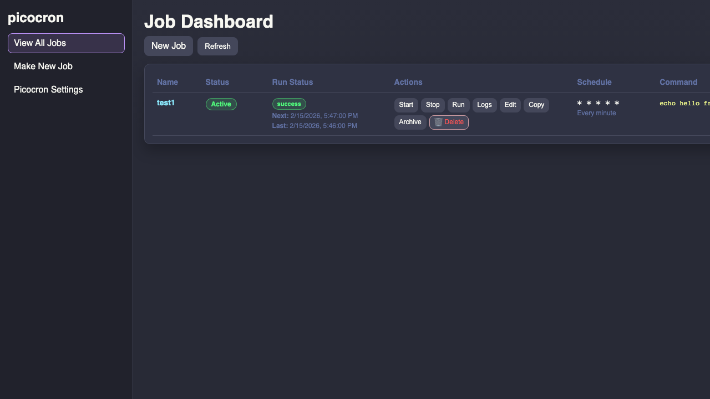
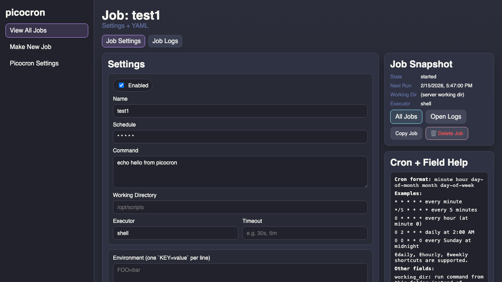
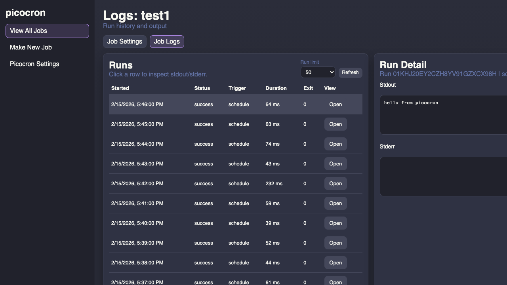

# Cronbat

Cronbat is a lightweight cron job daemon in Go with a built-in API and web UI.

## One-line Description

Run, schedule, observe, and manage background tasks from a single small Go binary.

## What It Does

- Schedules YAML-defined jobs using cron expressions
- Runs shell commands with optional timeout and working directory
- Stores run history in embedded SQLite
- Persists stdout/stderr logs with conservative retention defaults
- Exposes REST endpoints for job and run management
- Serves a dependency-light web UI from the same process
- Streams realtime updates to the UI via Server-Sent Events

## Screenshots

All screenshots are from the built-in UI (`/ui/`).





## Quick Start

### 1) Build

```bash
git clone git@github.com:patrickspencer/cronbat.git
cd cronbat
go build ./cmd/cronbat
```

### 2) Configure daemon

`cronbat.yaml`:

```yaml
listen: ":8080"
data_dir: "./data"
jobs_dir: "./jobs"
log_level: "info"
run_logs:
  enabled: true
  dir: "./data/logs"
  max_bytes_per_stream: 262144
  retention_days: 7
  max_total_mb: 128
  cleanup_interval: "1h"
```

### 3) Add a job

`jobs/hello.yaml`:

```yaml
name: hello
schedule: "*/5 * * * *"
command: "echo hello from cronbat"
```

### 4) Run

```bash
./cronbat -config cronbat.yaml
```

Open:

- UI: `http://localhost:8080/ui/`
- Health: `http://localhost:8080/api/v1/health`

## Web UI Pages

- `/ui/`: all jobs dashboard
- `/ui/new.html`: create job
- `/ui/job.html?name=<job>`: job settings + YAML
- `/ui/logs.html?name=<job>`: run history for a job
- `/ui/run.html?id=<run_id>`: single run log detail
- `/ui/settings.html`: daemon settings/status

## API Summary

Jobs:

- `POST /api/v1/jobs`
- `GET /api/v1/jobs`
- `GET /api/v1/jobs/{name}`
- `PUT /api/v1/jobs/{name}`
- `DELETE /api/v1/jobs/{name}`
- `POST /api/v1/jobs/{name}/run`
- `PUT /api/v1/jobs/{name}/start`
- `PUT /api/v1/jobs/{name}/stop`
- `GET /api/v1/jobs/{name}/yaml`
- `PUT /api/v1/jobs/{name}/yaml`

Runs/system:

- `GET /api/v1/runs`
- `GET /api/v1/runs/{id}`
- `GET /api/v1/runs/{id}/logs`
- `GET /api/v1/events`
- `GET /api/v1/config`
- `GET /api/v1/stats`
- `GET /api/v1/health`

## Project Layout

- `cmd/cronbat/main.go`: daemon bootstrap and wiring
- `internal/config/`: daemon and job YAML handling
- `internal/scheduler/`: cron scheduling engine
- `internal/runner/`: command execution and output capture
- `internal/store/`: SQLite persistence
- `internal/runlog/`: persisted run log files and cleanup
- `internal/web/api/`: REST handlers
- `internal/web/ui/`: embedded static UI
- `docs/LLM_PROJECT_GUIDE.md`: model-agnostic backend guide

## Contributing

1. Create a branch for your change.
2. Keep dependencies minimal and prefer standard library + existing packages.
3. Validate locally:

```bash
go test ./...
go build ./cmd/cronbat
```

4. Update docs when behavior changes (API/UI/config).
5. Open a PR with:
- Summary of behavior changes
- Test evidence
- Screenshots for UI changes

## Release

Create a release tag after merging to `main`:

```bash
git tag v0.1.0
git push origin v0.1.0
```

## License

MIT. See `LICENSE`.
